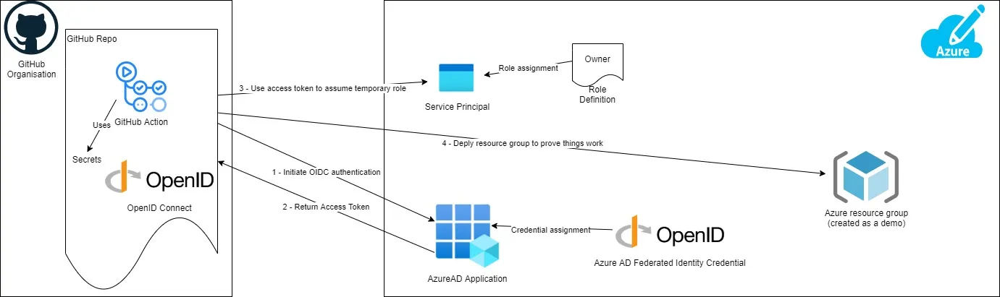

# GitHub Actions access to Azure Module

This module allows your GitHub Actions workflows to access resources in Azure, without needing to store the Azure credentials 
as long-lived GitHub secrets.

GitHub's OIDC provider works with Azure's workload identity federation. For an overview, see Microsoft's documentation at 
[Workload identity federation](https://docs.microsoft.com/en-us/azure/active-directory/develop/workload-identity-federation).

To configure the OIDC identity provider in Azure, you will need to perform the following configuration. For instructions 
on making these changes, refer to the [Azure documentation](https://docs.microsoft.com/en-us/azure/developer/github/connect-from-azure).

Overview of GitHub using Open ID Connect to authenticate to Azure:


This module performs:
- Create an Entra ID application and a service principal.
- Add federated credentials for the Entra ID application.
- Also creates 3 environment secrets in your repo for AZURE_CLIENT_ID, AZURE_TENANT_ID, and AZURE_SUBSCRIPTION_ID. 

## Usage

```hcl
module "gha_access_azure" {
  source = "git::git@github.com:toninoes/modulodromo.git//azure/github_actions_access_to_azure"

  app_display_name     = "my-app-name"
  github_repository    = "my-repository"
  resource_group_name  = "mi-resource-group-for-gha-access-to-azure"
  role_definition_name = "Contributor"
}
```

Testing OIDC. Create a workflow under .github/workflows directory of your repo:
```yml
name: Run Azure CLI Login with OpenID Connect
on: [push, workflow_dispatch]

permissions:
  id-token: write # Require write permission to Fetch an OIDC token.

jobs:
  test:
    runs-on: ubuntu-latest
    environment: sandbox
    steps:
    - name: Azure CLI Login
      uses: azure/login@v2
      with:
        client-id: ${{ secrets.AZURE_CLIENT_ID }}
        tenant-id: ${{ secrets.AZURE_TENANT_ID }}
        subscription-id: ${{ secrets.AZURE_SUBSCRIPTION_ID }}

    - name: Azure CLI script
      uses: azure/cli@v2
      with:
        azcliversion: latest
        inlineScript: |
          az account show
          # You can write your Azure CLI inline scripts here.
```

## Requirements

| Name | Version |
|------|---------|
| terraform | >= 1.3.0 |
| azuread | >= 3.0 |
| azurerm | >= 4.0 |
| github | >= 6.0 |

## Providers

| Name | Version |
|------|---------|
| azuread | 3.1.0 |
| azurerm | 4.18.0 |
| github | 6.5.0 |

## Modules

No modules.

## Resources

| Name | Type |
|------|------|
| [azuread_application.this](https://registry.terraform.io/providers/hashicorp/azuread/latest/docs/resources/application) | resource |
| [azuread_application_federated_identity_credential.this](https://registry.terraform.io/providers/hashicorp/azuread/latest/docs/resources/application_federated_identity_credential) | resource |
| [azuread_service_principal.this](https://registry.terraform.io/providers/hashicorp/azuread/latest/docs/resources/service_principal) | resource |
| [azurerm_role_assignment.this](https://registry.terraform.io/providers/hashicorp/azurerm/latest/docs/resources/role_assignment) | resource |
| [github_actions_secret.azure_client_id](https://registry.terraform.io/providers/integrations/github/latest/docs/resources/actions_secret) | resource |
| [github_actions_secret.azure_subscription_id](https://registry.terraform.io/providers/integrations/github/latest/docs/resources/actions_secret) | resource |
| [github_actions_secret.azure_tenant_id](https://registry.terraform.io/providers/integrations/github/latest/docs/resources/actions_secret) | resource |
| [github_actions_secret.extra_secrets](https://registry.terraform.io/providers/integrations/github/latest/docs/resources/actions_secret) | resource |
| [azuread_client_config.this](https://registry.terraform.io/providers/hashicorp/azuread/latest/docs/data-sources/client_config) | data source |
| [azurerm_client_config.this](https://registry.terraform.io/providers/hashicorp/azurerm/latest/docs/data-sources/client_config) | data source |
| [azurerm_resource_group.this](https://registry.terraform.io/providers/hashicorp/azurerm/latest/docs/data-sources/resource_group) | data source |

## Inputs

| Name | Description | Type | Default | Required |
|------|-------------|------|---------|:--------:|
| app\_description | A description of the application, as shown to end users. | `string` | `""` | no |
| app\_display\_name | The display name for the application. | `string` | n/a | yes |
| branches | Possible branches where we can deploy. | `list(string)` | <pre>[<br>  "main",<br>  "develop",<br>  "feature-branch"<br>]</pre> | no |
| federated\_identity\_credential\_description | A description for the federated identity credential. | `string` | `"Deployments for my-repo"` | no |
| federated\_identity\_credential\_display\_name | A unique display name for the federated identity credential. Changing this forces a new resource to be created. | `string` | `"GitHub-OIDC"` | no |
| github\_extra\_secrets | Extra GitHub environment secrets. | <pre>list(object({<br>    name  = string<br>    value = string<br>  }))</pre> | `[]` | no |
| github\_organization | The GitHub account. | `string` | `"toninoes"` | no |
| github\_repository | GitHub repository which contains GitHub Actions workflows to access resources in Azure. | `string` | n/a | yes |
| resource\_group\_name | The name of the resource group in which to create the virtual network. Changing this forces a new resource to be created | `string` | n/a | yes |
| role\_definition\_name | The name of a built-in Role. Changing this forces a new resource to be created. | `string` | `"Reader"` | no |
| sign\_in\_audience | The Microsoft account types that are supported for the current application. Must be one of AzureADMyOrg, AzureADMultipleOrgs, AzureADandPersonalMicrosoftAccount or PersonalMicrosoftAccount | `string` | `"AzureADMyOrg"` | no |
| spn\_description | A description of the service principal provided for internal end-users. | `string` | `""` | no |

## Outputs

| Name | Description |
|------|-------------|
| AZURE\_CLIENT\_ID | The client (application) ID of an App Registration in the tenant. |
| AZURE\_SUBSCRIPTION\_ID | A unique identifier for your Azure subscription. It's a 32-character alphanumeric string. |
| AZURE\_TENANT\_ID | A unique identifier associated with your Azure Active Directory (Azure AD) tenant. |
